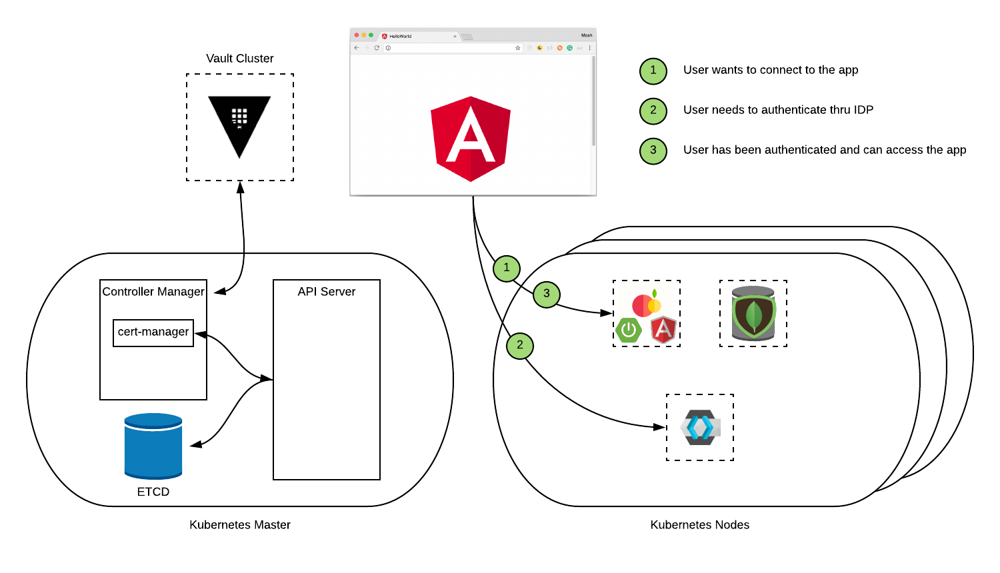
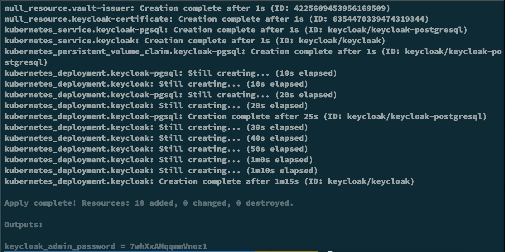
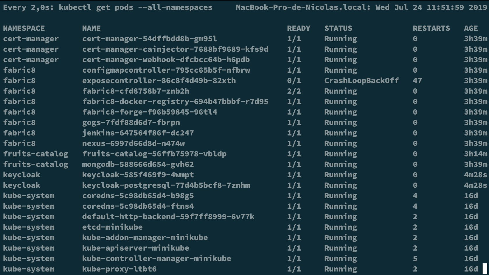
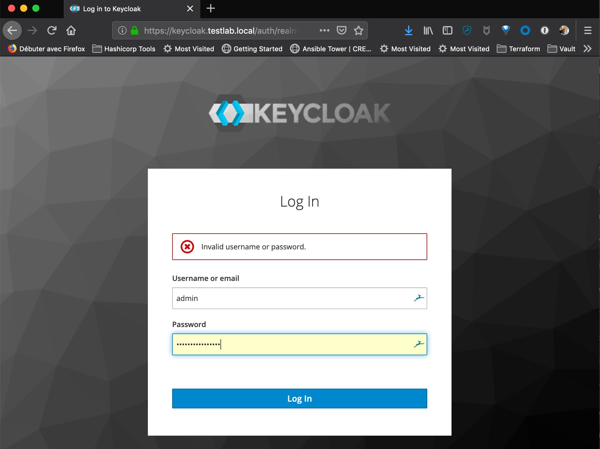
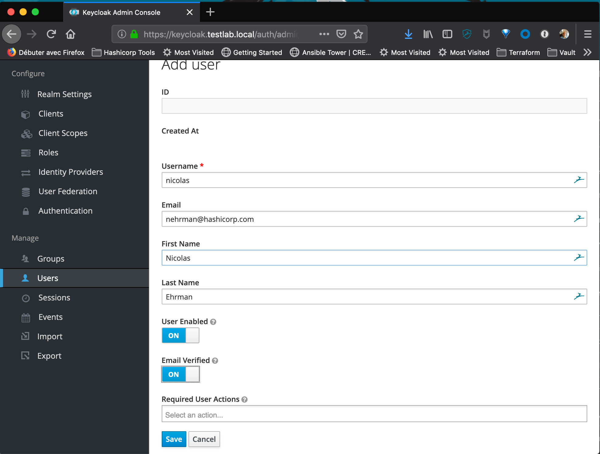
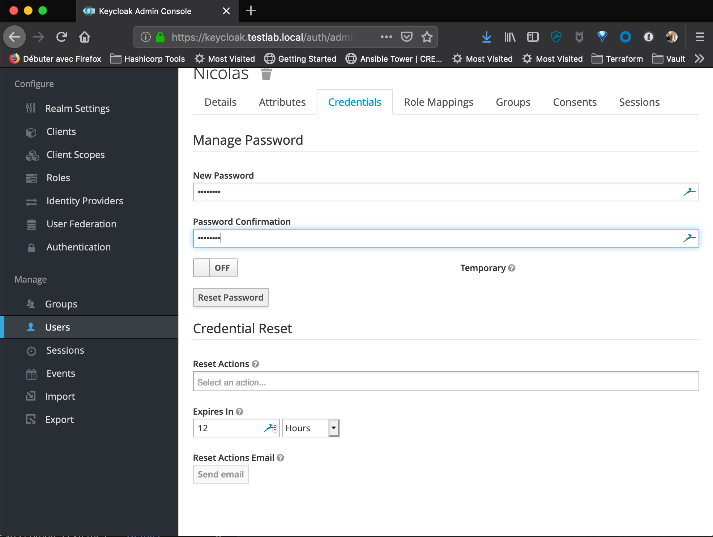
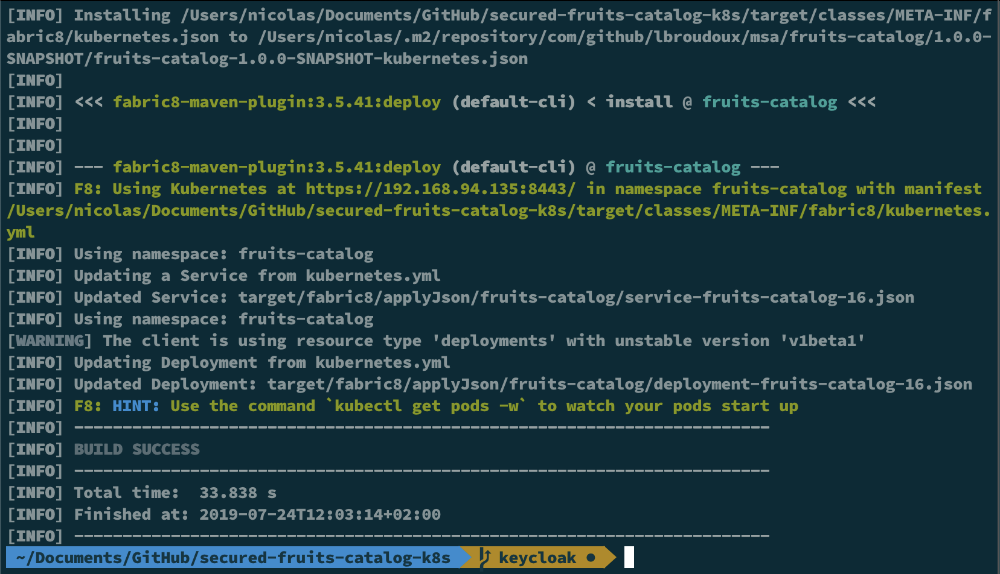
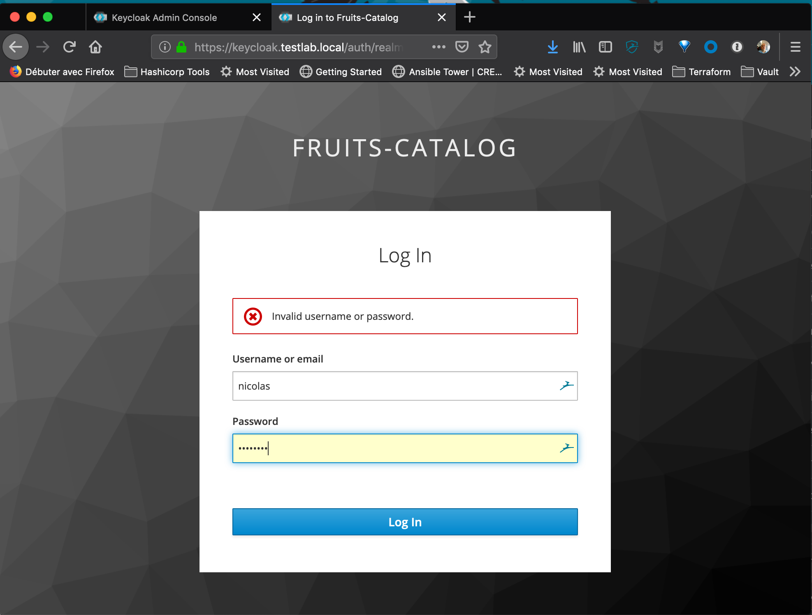
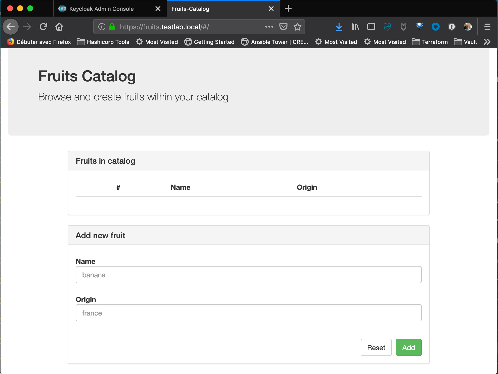

# hashiconfEU-2019 - Securing your apps without touching code !!!
## Step 2 - Adding Authentication and Authorization with Keycloak

After Step 1 where we illustrate how to integrate Vault and cert-manager to automate certificate insuance for ingress route in Kubernetes, let's continue with this demo to demonstrate how to use [Keycloak](https://www.keycloak.org/) and some minor change in your Application to add authentication and authorization.

Here are the technologies and features used in this demo:
- [Terraform](https://www.terraform.io)
- [Minikube with Nginx as Ingress Router](https://kubernetes.io/docs/tasks/tools/install-minikube/)
- [Cert-manager](https://github.com/jetstack/cert-manager)
- [Vault with PKI Secret Engine](https://www.vaultproject.io)
- [Fabric8](https://fabric8.io/)
- [Keycloak](https://www.keycloak.org/)

As always, let's look at what we're gonna do in terms of workflow and architecture.



## Ok, now, we're ready to use terraform code to deploy step 2
Of course, we will not cover how to [download](https://releases.hashicorp.com/terraform/) and [configure](https://learn.hashicorp.com/terraform/getting-started/install.html) it, as we supposed you already have it.

1. **Configure Env variables** - To be able to connect to vault, we need to set up VAULT_TOKEN with that command:
    ```bash
    export VAULT_TOKEN=root
    ```
    That's the only variable we have to configure for vault  provider for terraform. All others variables are defined in the **variables.tf** file.

2. **Analyze the code to understand what we're gonna do** - Yeah, even if most of the tasks are automated, it is still interesting to understand what the code will do:
    - Configure a Vault-Issuer for cert-manager in the keycloak namespace
    - Configure a specific ingress route for Keycloak with SSL
    - Configure a specific Role in Vault and create a token used by Vault-Issuer
    - deploy and configure Keycloak on K8s

3. **It's time to use Terraform** - That's not the final step, but at least, you don't have to do everything manually :)
    - Run terraform init to prepare the environment:
    ```bash
    $>terraform init
    ```
    - Run terraform plan to see if everything is correct: 
    ```bash
    $>terraform plan
    ```
    - And finally, run terraform apply to make the magic happen: 
    ```bash
    $>terraform apply
    ```

    You should end up with something like this:
    

    **Store somewhere the admin password for Keycloak as it will be used in a later step**

    You can also check the state of all the newly created pods by running the command:
    ```bash
    $>kubectl get pods --all-namespaces
    ```

    

## Finalize Keycloak configuration
As keycloak is now deployed and available on K8s in its own namespace and with its own certificate, we can connect to it and finalize the configuration by creating some users.

1. **Login to admin console and create a user** - Keycloak is configured with 3 Roles (Admin, Manager, User) but without any user except the admin of the platform. So, let's create one to test our authn and authz.
    - Connect to https://keycloak.testlab.local or whatever url you used and log in with 'adminKC' as user and the password that you gathered in terraform apply step:
    
    
    - Select 'Admin Console', then 'Manage', then 'Users', then click on 'Add User', and finally configure a new user:
    
    
    - Now, after creating the user, change its password and configure it as 'non temporary':
    

## Deploy the new version of the application
Keycloak is configured, so, now, we need to deploy the new version of our app that included keycloak configuration and logic.

1. **Git checkout to Keycloak branch** - First thing first, go the the keycloak branch of the secured-fruits-catalog-k8s repo.
    - Do git checkout command below inside your secured-fruits-catalog-k8s repos:
    ```bash
    $>git checkout keycloak
    ```
2. **Deploy the new version of the app** - As we added Keycloak in the logic of our application, we have to build it and deploy it to replace the old one.
    - Now, use maven and Fabric8 plugin to do it:
    ```bash
    $>mvn fabric8:deploy -Pkubernetes
    ```
    You should see an output like this: 
    

    - To make the application working, we need to modify the deployment for adding KEYCLOAK_URL as ENV variable:
    ```bash
    $>kubectl set env deploy/fruits-catalog KEYCLOAK_URL=https://keycloak.testlab.local/auth -n fruits-catalog
    ```
3. **Validate the AuthN and AuthZ workflow** - Everything is configured properly, so the last step is to test that everything works.
    - Connect to 'https://fruits.testlab.local' and verify that now a login page appears:
    

    - Verify than you're logged in properly:
    

    - Add a new fruit for validating everything is working:
    

*Congrats*, you finally deploy and configure Keycloak to add AuthN and AuthZ to your application without modifying a lot of code in your app.

We're ready to move on to step 3 and add Static Secret management with by using K8S Auth method.

## Special thanks

* **Laurent Broudoux** - For the App code and for working together on that project [Github](https://github.com/lbroudoux)

## Authors

* **Nicolas Ehrman** - *Initial work* - [Hashicorp](https://www.hashicorp.com)