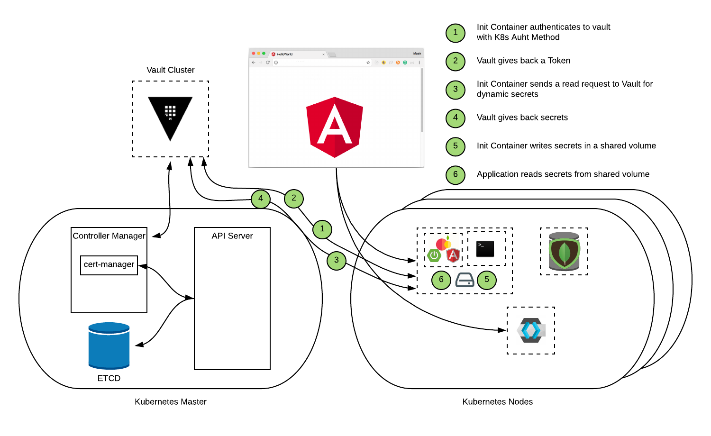
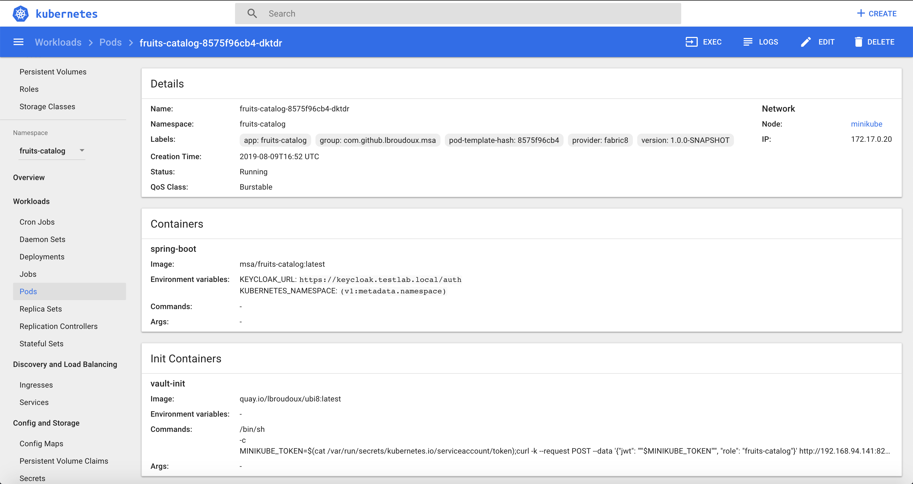
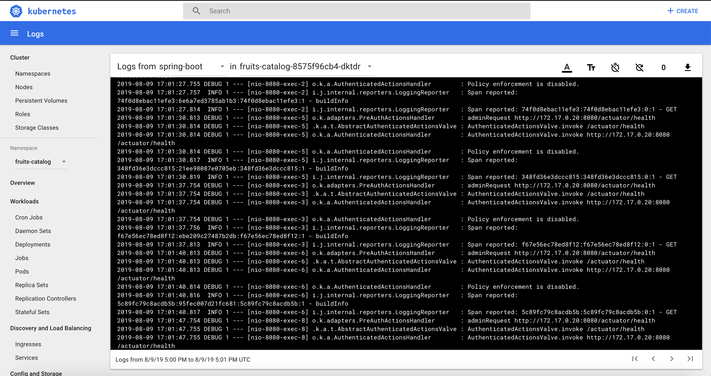
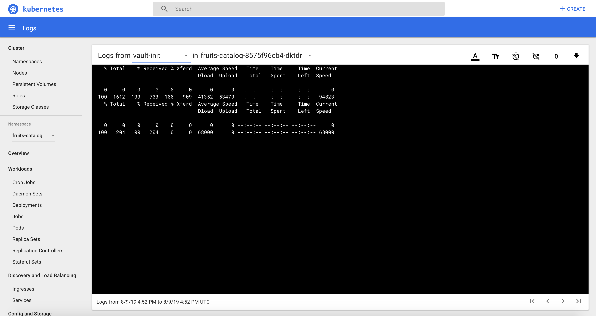
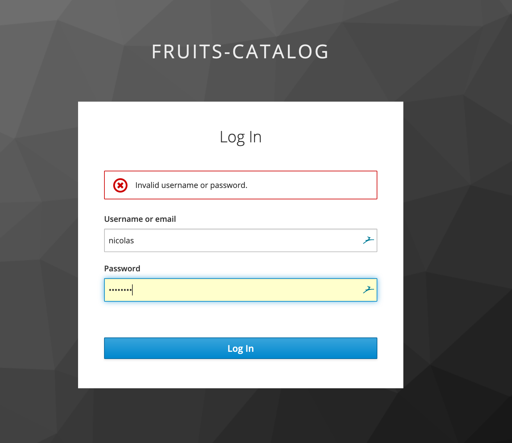
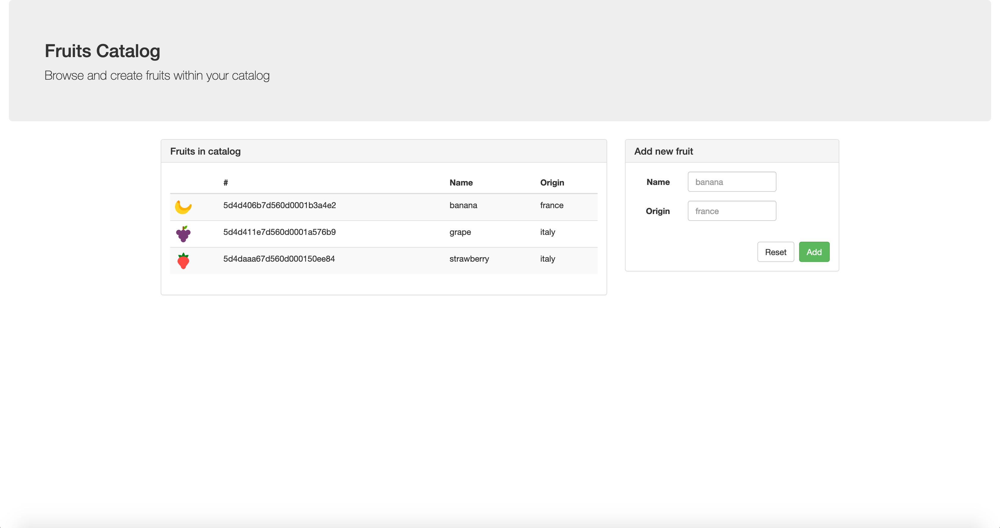

# hashiconfEU-2019 - Securing your apps without touching code !!!
## Step 4 - Adding even more security with Vault Dynamic Secrets for MongoDB

Just a quick reminder on what we did so far :
- Step 1 : Use Jetstack/cert-manager and Vault to provide TLS for Ingress Traffic
- Step 2 : Adding Authentication and Authorization with Keycloak
- Step 3 : Adding Static Secret Management to your app

Now, that's the fourth step of our journey to a highly secure application where we're gonna go further with secrets management. Oh yeah, now, we want to use dynamic secrets, that means automatically generated by [Vault](https://www.vaultproject.io), in order to increase again our level of security.

Here are the technologies and features used in this demo:
- [Terraform](https://www.terraform.io)
- [Minikube with Nginx as Ingress Router](https://kubernetes.io/docs/tasks/tools/install-minikube/)
- [Vault with Dynamic (Database) Secret Engine](https://www.vaultproject.io)
- [Robo 3T](https://robomongo.org/)

As always, let's look at what we're gonna do in terms of workflow and architecture.



## Ok, now, we're ready to use terraform code to deploy step 4
Of course, we will not cover how to [download](https://releases.hashicorp.com/terraform/) and [configure](https://learn.hashicorp.com/terraform/getting-started/install.html) it, as we supposed you already have it.

1. **Configure Env variables** - To be able to connect to vault, we need to set up VAULT_TOKEN with that command:
    ```bash
    export VAULT_TOKEN=root
    ```
    That's the only variable we have to configure for vault  provider for terraform. All others variables are defined in the **variables.tf** file.

2. **Import Fruits-catalog Deployment in your State file** - Like we did in step 3, we also have to import the existing fruits-catalog deployment to our state file. In order to do that, we have to use that command:
    ```bash
    $>terraform import kubernetes_deployment.fruits-catalog fruits-catalog/fruits-catalog
    ```

    Check that you have well imported your ressource:
    

3. **Analyze the code to understand what we're gonna do** - Yeah, even if most of the tasks are automated, it is still interesting to understand what the code will do:
    - Creating a service in order to give access to MongoDB from Vault 
    - Enabling and configuring Datbase Dynamic Secret backend for MongoDB
    - Creating a policy to give read access to kv/fruits-catalog-mongodb
    - Updating fruits-catalog role previously created to add the new policy
    - Deploying fruits-catalog with a vault-lease-refresher 


4. **It's time to use Terraform** - That's not the final step, but at least, you don't have to do everything manually :)
    - Before that, we need to configure some variables. You have to create a tfvars file with these variables :
    ```hcl
    mongodb_username = "admin"
    mongodb_pwd = "pvw0rUsUHZv3lweE"
    mongodb_host = "192.168.94.135"
    mongodb_nodeport = "30656"
    ```

    If you didn't save your mongodb admin password from step 1, you can retrieve it with that command: 
    ```bash
    $> kubectl get secret/mongodb -o jsonpath="{.data.database-admin-password}" | base64 -D
    ```

    - Run terraform init to prepare the environment:
    ```bash
    $>terraform init
    ```
    - Run terraform plan to see if everything is correct: 
    ```bash
    $>terraform plan
    ```
    - And finally, run terraform apply to make the magic happen: 
    ```bash
    $>terraform apply
    ```

    You should end up with something like this:
    
    

## Validate everything is working as expected 
Now, your application is using an init container which uses the service account token from K8s to: 
- Connect to vault 
- Retrieve the secrets
- Register secrets in application.properties file in a shared volume 
But also, in regards of step 3, a sidecar refresher container, that is used for ensuring the renew of the lease until the pod dies, is popped beside the fruits-catalog container.

To ensure everything is work as expected, follow the below steps.

1. **Validate log on the init-container** - Here, we're gonna check if init-container was able to retrieve the secret and create the correct files.
    - First, you need to launch the minikub's dashboard with that command:
    ```bash
    $>minikube dashboard
    ```
    Your browser should popup with the Kubernetes Dashboard

    
    
    - Select the fruits-catalog namespace, then pods, then your fruits-catalog pod and finally click on **log**:

    
    
    - Click on **logs from** and select **vault-init**, you should see no errors:

    

2. **Validate log on the vault-lease-refresher sidecar container**: 

3. **Check dynamic credentials on MongoDB with Robo 3T**: 

4. **Validate configuration files on spring-boot container**: Now, we want to check that we're really using the secrets from vault and not from Kubernetes.
    - Connect to your container using that command:
    ```bash
    $>kubectl exec -ti fruits-catalog-8575f96cb4-dktdr -c spring-boot /bin/bash
    ```

    

    - Go to /etc/app/ and read the application.properties. You should see something like this: 

    


5. **Connect to the app and validate all your datas are sitll there** - Finally, we connect to our apps to validate that all is working perfectly.
    - Connect thru your browser to your application with https://fruits.testalb.local and enter your username and password configured in step 2.
    
    

    - Vaildate that all your previous fruits are still there and that you can add more.

     


*Congrats*, you finally deploy and configure Keycloak to add AuthN and AuthZ to your application without modifying a lot of code in your app.

We're ready to move on to step 3 and add Static Secret management with by using K8S Auth method.

## Special thanks

* **Laurent Broudoux** - For the App code and for working together on that project [Github](https://github.com/lbroudoux)

## Authors

* **Nicolas Ehrman** - *Initial work* - [Hashicorp](https://www.hashicorp.com)