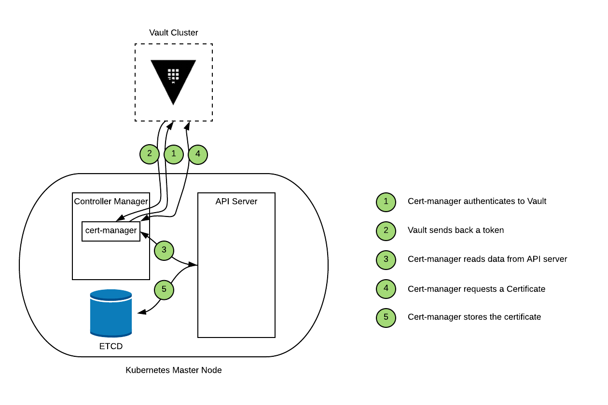
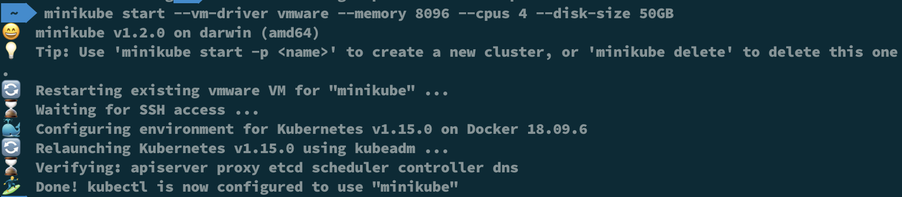
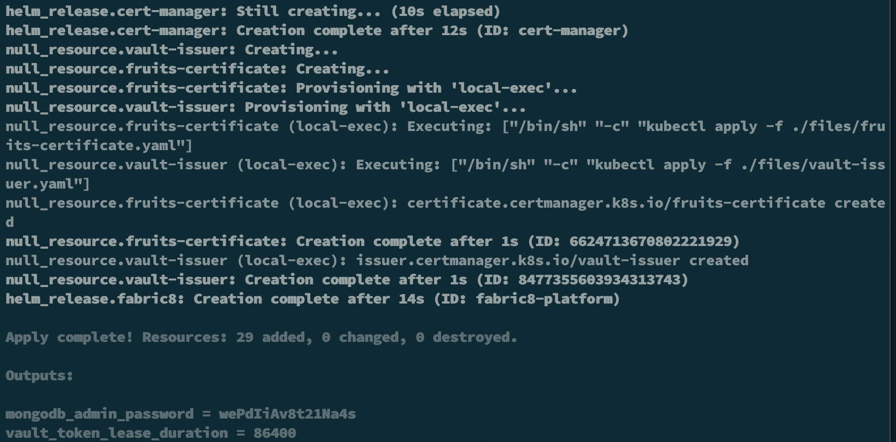
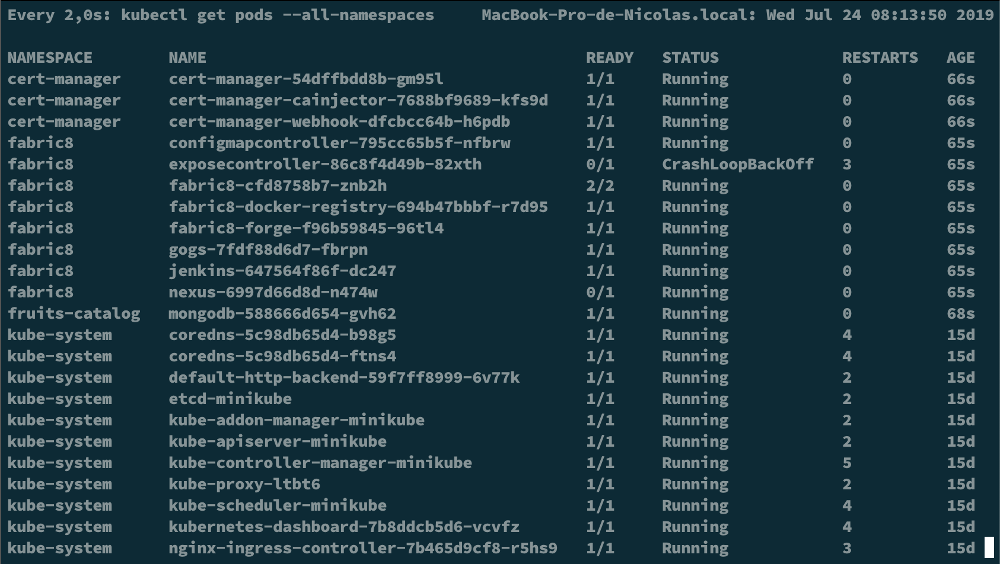
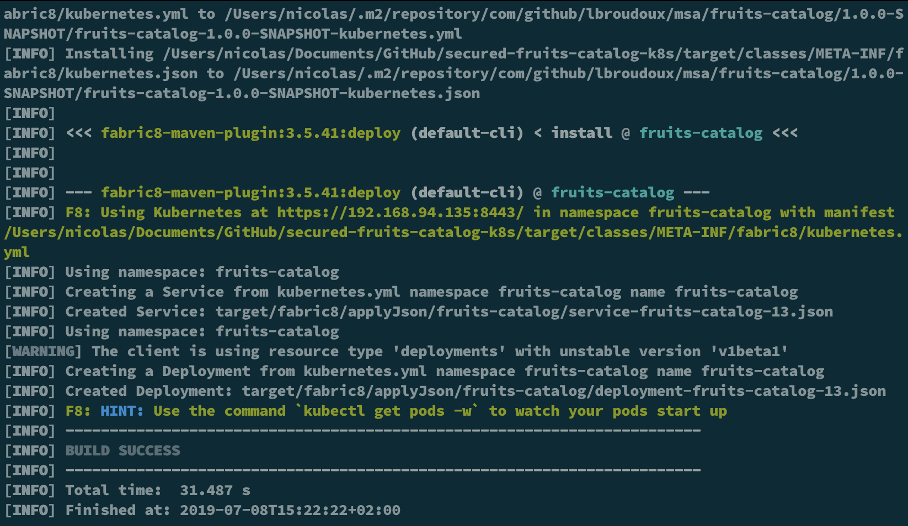

# hashiconfEU-2019 - Securing your apps without touching code !!!
## Step 1 - Use Jetstack/cert-manager and Vault to provide TLS for Ingress Traffic

This demo illustrates how to leverage [jetstack/cert-manager](https://github.com/jetstack/cert-manager) and [Vault](https://www.vaultproject.io) to automate the management and issuance of TLS certficates in K8s environment.

Here are the technologies and features used in this demo:
- [Terraform](https://www.terraform.io)
- [Minikube with Nginx as Ingress Router](https://kubernetes.io/docs/tasks/tools/install-minikube/)
- [Cert-manager](https://github.com/jetstack/cert-manager)
- [Vault with PKI Secret Engine](https://www.vaultproject.io)
- [Fabric8](https://fabric8.io/)

But, wait, what does it means in terms of architecture?



## How to prepare your environment for this demo?
Here's what you need as prerequisites on your laptop (even if this demo could be done on any managed K8s cluster)

1. **Clone Repos** - First, even if it's quite obvious, you need to clone the repos needed by this demo.
    - Clone this repos with that command:
    ```bash
    $>git clone https://github.com/nehrman/hashiconfEU-2019
    ```
    - Clone also the repo for the Java app:
    ```bash
    $>git clone https://github.com/nehrman/secured-fruits-catalog-k8s
    ```
    It's a fork from the original one made by **Laurent Broudoux** with some adaptations.

2. **Install & Configure Minikube** - You need to [install](https://kubernetes.io/docs/tasks/tools/install-minikube/) and [configure](https://kubernetes.io/docs/setup/learning-environment/minikube/) Minikube on your laptop.
    - to do so, on mac os, you have to launch this command to install minikube: 
    ```bash
    $>brew cask install minikube
    ```
    - Then, you have to enable **Nginx* Ingress Router:
    ```bash
    $>minikube addons enable ingress
    ```
    - Start minikube with your driver of choice (for me, i am using vmware driver) and with enough resources to handle all services we need:
    ```bash
    $>minikube start --vm-driver vmware --memory 8096 --cpus 4 --disk-size 50GB
    ```

    You should end up with something like this:
    

    - Now, we have to install Helm and configure tiller:
    ```bash
    $>brew install helm
    $>kubectl create sa tiller -n kube-system
    $>kubectl create clusterrolebinding tiller-admin --serviceaccount=kube-system:tiller --clusterrole=cluster-admin
    $>helm init --service-account=tiller

3. **Start a Vault Server in Dev Mode** - In order to use PKI Secret engine from Vault, you need to start a Vault server on your local machine.
    - Download Vault from the Hashicorp website, unzip it and add it to your path:
    ```bash
    curl https://releases.hashicorp.com/vault/1.1.3/vault_1.1.3_darwin_amd64.zip -o vault.zip
    unzip vault.zip
    sudo mv vault /usr/local/bin
    ```
    - For the sake of simplicity, we're using a vault server in dev mode. Of course, you can decide to use your existing vault or to build a real one with our [guides](https://github.com/hashicorp/terraform-aws-vault) on AWS
    ```bash 
    vault server -dev -dev-listen-address="0.0.0.0:8200" -dev-root-token-id="root"
    ```
Now, all prereqs are met and we can move forward ...

## Ok, now, we're ready to use terraform code to deploy step 1
Of course, we will not cover how to [download](https://releases.hashicorp.com/terraform/) and [configure](https://learn.hashicorp.com/terraform/getting-started/install.html) it, as we supposed you already have it.

1. **Configure Env variables** - To be able to connect to vault, we need to set up VAULT_TOKEN with that command:
    ```bash
    export VAULT_TOKEN=root
    ```
    That's the only variable we have to configure for vault  provider for terraform. All others variables are defined in the **variables.tf** file.

2. **Analyze the code to understand what we're gonna do** - Yeah, even if most of the tasks are automated, it is still interesting to understand what the code will do:
    - Configure Vault PKI Secret Engine for Root certificate
    - Configure Vault PKI Secret Engine for Intermediate certificate
    - Configure a Role to be able to generate certificate on-demand
    - Configure a policy called "fruits-catalog" that allow access to PKI to be able sign request and issue certificate
    - Generate a token that will be used by cert-manager and Vault-Issuer later in the process
    - Deploy and configure cert-manager
    - Deploy and configure fabric8
    - Configure ingress route for our App
    - Deploy MongoDB on K8s

3. **It's time to use Terraform** - That's not the final step, but at least, you don't have to do everything manually :)
    - Run terraform init to prepare the environment:
    ```bash
    $>terraform init
    ```
    - Run terraform plan to see if everything is correct: 
    ```bash
    $>terraform plan
    ```
    - And finally, run terraform apply to make the magic happen: 
    ```bash
    $>terraform apply
    ```

    You should end up with something like this:
    
    **Store somewhere the admin password for MongoDB Database as it will be used in a later step**

    You can also check the state of all the newly created pods by running the command:
    ```bash
    $>kubectl get pods --all-namespaces
    ```

    

## Finally, you can deploy the fruits-catalog app using Fabric8 and Maven
Last task for finalizing this demo is to build and deploy fruits-catalog application from its repos.

1. **Prepare your environment** - First thing to do is to prepare the environment to work with minikube and a specific context.
    - Configure your bash environment for using docker daemon inside minikube:
    ```bash
    $>eval $(minikube docker-env)
    ```
    - Modify the context to use fruits-catalog as default namespace:
    ```bash
    $>kubectl config set-context $(kubectl config current-context) --namespace=fruits-catalog
    ```
2. **Use maven to build and deploy the fruits-catalog app** - It's time to deploy the app and make sure everything works as expected.
    - Run maven to build the app: (We consider that maven is already install on your laptop - if not run brew install maven)
    ```bash
    $>mvn fabric8:deploy -Pkubernetes
    ```

    You should end up with something like this:
    

3. **It's time to test if certificate is well generated and configured** - 


## Special thanks

* **Laurent Broudoux** - For the App code and for working together on that project [Github](https://github.com/lbroudoux)

## Authors

* **Nicolas Ehrman** - *Initial work* - [Hashicorp](https://www.hashicorp.com)